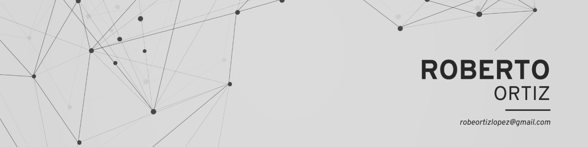

<h2 align="left">Sobre mí</h2>

Mi nombre es Roberto Ortiz, soy de Sevilla y nací en Mayo de 1993. Actualmente soy estudiante del ciclo formativo de grado superior de desarrollo de aplicaciones multiplataforma. Tengo el título de técnico en sistemas microinformáticos y redes pero he estado trabajando por 10 años en un sector completamente distinto. La informática siempre me ha apasionado y tras pensarlo mucho, decidí dejarlo todo para estudiar el ciclo superior y dedicarme a lo que realmente me gusta.

<h2 align="left">Formación</h2>
<ul>
  <li>
    Técnico en sistemas microinformáticos y redes.
  </li>
 <li>
  <a href="https://catalog-education.oracle.com/pls/certview/sharebadge?id=7C8DA411DDF26CA0E9A6DE6417A6AB13052B597D3DF8B76DC43A0E1AFC60F98B" target="_blank"> Oracle Certified Associate, Java SE 8 Programmer. </a> 
 </li>
 <li>
   <a href="https://catalog-education.oracle.com/pls/certview/sharebadge?id=53BCDB333E766EAAB4B734AC379253BC56359F8525016FCBAF9C03A0872FD50A" target="_blank"> Oracle Certified Professional: Java SE 17 Developer. </a>
 </li>
</ul>
<h2 align="left">  Competencias</h2>

  
  
  
  
  
  
  
  
  
  
  
  
  
  
  
  
  
  
  
  
  
  
  
  
  
  
  
  
  
  
  
  
  
  
  
  
  
  
  

<h2 align="left">Contacto</h2>

  
  

<h2>   Github Stats </h2>

  
  

